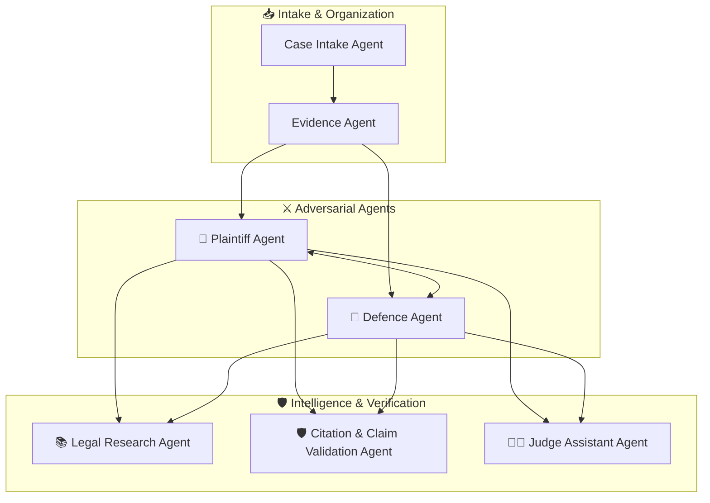
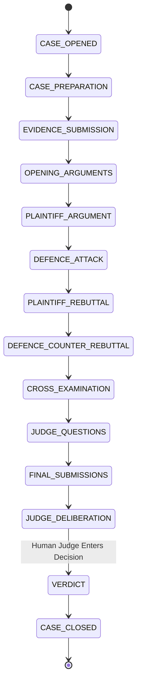

# ⚖️ AADALAT AI — Multi-Agent Architecture & LangGraph Workflows

## 1. Agent Design Principles

1. **Role-Bounded Autonomy:** Each agent operates under strict procedural roles and ethical constraints.
2. **Evidence-Grounded Argumentation:** Every factual proposition MUST point to an admitted evidence ID.
3. **No Hallucinated Citations:** Every statutory or case law reference must be validated against the verified legal corpus.
4. **Information Isolation:** Private party evidence is strictly compartmentalized until formally submitted in the proceeding.
5. **No Autonomous Verdicts:** The AI agents argue, attack, defend, cross-examine, and organize facts, but only the Human Judge ("My Lord") decides.

---

## 2. The Agent Ensemble

### 2.1 Case Intake Agent
- **Goal:** Ingest unstructured natural language case narratives, claims, and counter-claims.
- **Output:** Normalized case structured JSON (Parties, Causes of Action, Disputed Amounts, Chronology, Admitted vs Disputed Facts).

### 2.2 Evidence Agent
- **Goal:** Perform forensic extraction, hashing, OCR, entity extraction, and timeline anchoring on uploaded exhibits.
- **Output:** Categorized evidence catalog, timeline events, and conflict alerts.

### 2.3 Legal Research Agent
- **Goal:** Retrieve binding statutes, regulations, and landmark precedents relevant to the legal issues raised.
- **Rules:** If a requested proposition has no authoritative source in the verified database, output explicitly: *"Unable to verify authoritative source."*

### 2.4 Plaintiff Agent
- **Goal:** Construct the affirmative case theory for the Plaintiff / Claimant.
- **Capabilities:** Formulate opening statements, marshal supportive exhibits, launch structured attacks against Defence counterarguments, and conduct focused cross-examinations.

### 2.5 Defence Agent
- **Goal:** Mount a rigorous defence against the Plaintiff's claims.
- **Capabilities:** Identify evidentiary voids, timeline discrepancies, failure of statutory preconditions, lack of causation, and exaggerated damages.

### 2.6 Validation Agent
- **Goal:** Real-time factual and legal claim validator.
- **Mechanism:** Runs NLI checks against admitted evidence and validates citations against the court knowledge base.

### 2.7 Judge Assistant Agent
- **Goal:** Objective judicial clerk assisting the Human Judge.
- **Capabilities:** Synthesizes the core points of contention, lists unaddressed queries, highlights evidentiary contradictions, and prepares prompt summaries for the Judge.

---

## 3. Courtroom Turn-Taking State Machine

---

## 4. Attack Types Classification
When an agent challenges an opposing proposition, it specifies one of 9 deterministic attack categories:
1. `FACTUAL_CONTRADICTION`: Evidence directly contradicts the stated fact.
2. `EVIDENCE_WEAKNESS`: Exhibit is uncorroborated, hearsay, or ambiguous.
3. `MISSING_EVIDENCE`: Required burden of proof lacks any supporting document.
4. `LEGAL_DISTINCTION`: Cited precedent is distinguishable on material facts.
5. `TIMELINE_CONFLICT`: Chronological impossibility in the opposing sequence of events.
6. `ALTERNATIVE_INTERPRETATION`: The evidence reasonably supports an opposing inference.
7. `SOURCE_RELIABILITY`: Timestamp, chain of custody, or author authenticity is compromised.
8. `CAUSATION_CHALLENGE`: The alleged breach did not cause the claimed loss.
9. `QUANTUM_CHALLENGE`: Damages or financial amounts claimed are inflated or unliquidated.
