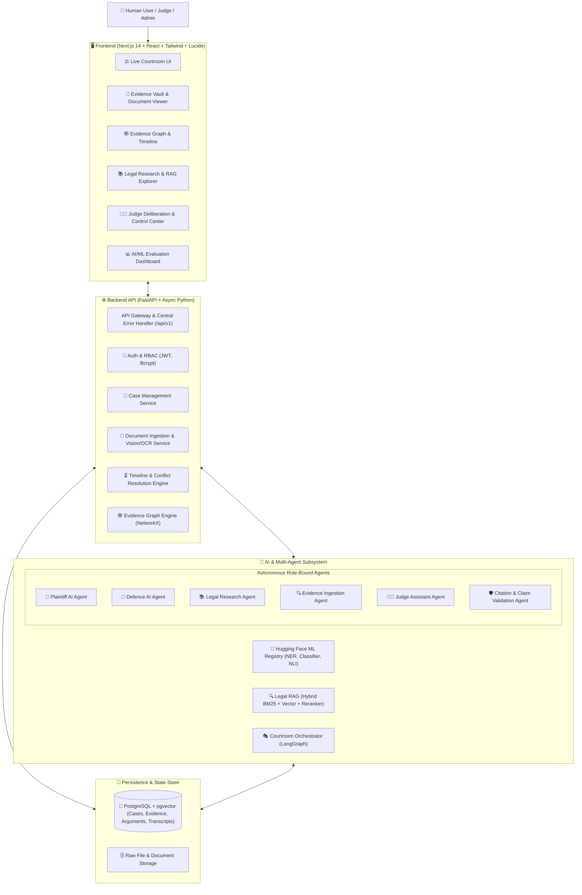

# ⚖️ AADALAT AI — System Architecture Document

> **"AI argues. Evidence speaks. My Lord decides."**

---

## 1. Executive Summary

**Aadalat AI** is an evidence-grounded multi-agent courtroom simulation and legal intelligence platform designed to assist legal preparation, research, claim grounding, contradiction analysis, and mock judicial hearings. 

The core design principle is:
```
AI PREPARES ➔ AI RESEARCHES ➔ AI ARGUES ➔ AI ATTACKS ➔ AI DEFENDS ➔ AI ORGANIZES
                                  │
                                  ▼
                        ⚖️ MY LORD DECIDES
```
Under no circumstances does the AI autonomously enter judicial verdicts or provide unauthorized legal representation. The Human Judge ("My Lord") maintains absolute sovereignty and procedural control over all courtroom sessions, deliberations, and judgments.

---

## 2. High-Level Architecture Diagram



---

## 3. Core Subsystems

### 3.1 Backend Foundation (FastAPI)
- **Asynchronous Architecture:** Python `async`/`await` powered by `uvicorn` and `asyncpg` / `aiosqlite`.
- **Standardized Response Envelope:**
  ```json
  {
    "success": true,
    "data": { ... },
    "error": null,
    "request_id": "uuid-v4"
  }
  ```
- **Error Handling:** Global exception interception mapping database errors, validation faults, and agent execution errors into human-readable codes.
- **Security & RBAC:** Role-Based Access Control enforcing distinct boundaries for `USER`, `JUDGE`, and `ADMIN`.

### 3.2 Evidence & Document AI Subsystem
- **Immutable Raw Ingestion:** Uploaded files (PDF, PNG, JPG, TXT, DOCX) are validated for MIME type, hashed with SHA-256, and stored immutably.
- **Multimodal Extraction:** High-speed PyMuPDF text extraction + OCR fallback for scanned artifacts.
- **Preserved Provenance:** Every extracted chunk preserves document ID, page number, coordinates (when available), and file hash.
- **Evidence Vault Statuses:** `INDEXED`, `VERIFIED`, `UNVERIFIED`, `CONFLICTING`, `FLAGGED`.

### 3.3 Hugging Face ML Pipeline
- **Legal NER:** Specialized extraction of `PERSON`, `ORGANIZATION`, `COURT`, `JUDGE`, `LAWYER`, `STATUTE`, `SECTION`, `MONEY`, `DATE`, `CONTRACT`.
- **Zero-Shot & Multi-Class Classifiers:** Domain classification for case types (CIVIL, CRIMINAL, CONSUMER, EMPLOYMENT, etc.) and document typologies (AFFIDAVIT, CONTRACT, INVOICE, NOTICE, etc.).
- **NLI / Contradiction Engine:** Pairwise RoBERTa-MNLI inference between claims and evidence passages outputting `ENTAILMENT`, `CONTRADICTION`, or `NEUTRAL`.
- **Claim Grounding Engine:** Factual claims emitted by AI agents are verified against evidence vectors before submission.

### 3.4 Legal RAG & Hybrid Retrieval
- **Structure-Aware Legal Chunking:** Respects judicial document structure (Headnotes, Facts, Issues, Ratio Decidendi, Obiter Dicta, Order).
- **Hybrid Retrieval:** Dense vector search (Sentence-Transformers `all-MiniLM-L6-v2`) combined with sparse BM25 keyword matching and cross-encoder reranking.
- **Citation Validator:** Validates whether cited precedents exist in the authoritative corpus and match the cited legal proposition.

### 3.5 Multi-Agent System (LangGraph)
- **Role-Bound Agents:**
  - `Plaintiff Agent`: Builds plaintiff theory, references admitted evidence, attacks defence weaknesses.
  - `Defence Agent`: Identifies missing proof, attacks timeline gaps, raises statutory defences.
  - `Research Agent`: Discovers verified legal authorities and statutory provisions.
  - `Judge Assistant`: Organizes facts, summarizes disputed issues, prepares question briefs for the judge.
  - `Validation Agent`: Enforces information boundary rules and flags unsupported claims.
- **Strict Information Boundaries:** Private unadmitted evidence of one party is sequestered until formally introduced during proceedings.

### 3.6 Deterministic Courtroom State Machine
```
CASE_OPENED
    │
    ▼
CASE_PREPARATION
    │
    ▼
EVIDENCE_SUBMISSION
    │
    ▼
OPENING_ARGUMENTS
    │
    ▼
PLAINTIFF_ARGUMENT ◄────┐
    │                   │ (Attack / Defence Loop)
    ▼                   │
DEFENCE_ATTACK          │
    │                   │
    ▼                   │
PLAINTIFF_REBUTTAL ─────┘
    │
    ▼
CROSS_EXAMINATION
    │
    ▼
JUDGE_QUESTIONS
    │
    ▼
FINAL_SUBMISSIONS
    │
    ▼
JUDGE_DELIBERATION
    │
    ▼
VERDICT (ENTERED BY HUMAN JUDGE)
    │
    ▼
POST_HEARING_REPORT & EVALUATION
```

---

## 4. Security & Compliance Principles
1. **Fictionalized Sandbox:** All demo cases are synthetic and marked with explicit disclaimers.
2. **Untrusted Input Sanitation:** Document content is treated as data, preventing prompt injection attacks against downstream LLMs.
3. **Audit Trail:** Every agent turn, tool call, NLI score, and state transition is logged with timestamped UUIDs.
