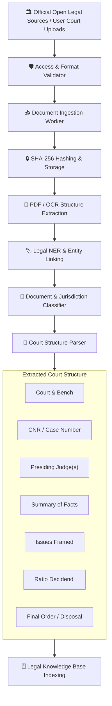

# ⚖️ AADALAT AI — Court Intelligence & Permitted Ingestion

## 1. Compliance & Legal Ingestion Guardrails
Aadalat AI adheres strictly to the following principles:
- **No Anti-Bot Bypassing:** We do NOT bypass CAPTCHA, Cloudflare challenges, OTP logins, or anti-scraping protections on private court portals.
- **Permitted Sources Only:** Ingestion connects only to authorized open datasets, public domain judgments, licensed repositories, and user-uploaded trial documents.
- **Clear Provenance:** Every ingested judgment, statute, or order maintains an unalterable provenance record (Source URL, Hash, Retrieval Timestamp, Bench, CNR).

---

## 2. Court Data Ingestion Pipeline

---

## 3. Supported Court Data Connectors
1. **`UserCourtDocConnector`**: Ingests user-submitted pleadings, certified judgment copies, and case orders.
2. **`PublicCaseArchiveConnector`**: Loads open legal databases and landmark public interest judgments.
3. **`FictionalDemoDataConnector`**: Generates synthetic, fully coherent trial bundles for the 5 benchmark cases.
