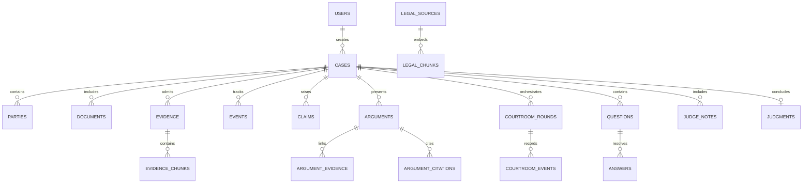

# ⚖️ AADALAT AI — Database Schema & Data Models

## 1. Overview
The persistence layer of Aadalat AI is architected using **PostgreSQL + pgvector** (with native async fallback support via `aiosqlite` for lightweight embedded testing). All primary keys are UUIDv4 to support distributed synchronization and tamper-evident audit logs.

---

## 2. Entity Relationship Model

---

## 3. Core Tables Specification

### 3.1 `users`
- `id` (UUID, PK)
- `email` (String, Unique, Index)
- `hashed_password` (String)
- `full_name` (String)
- `role` (Enum: `USER`, `JUDGE`, `ADMIN`)
- `is_active` (Boolean)
- `created_at`, `updated_at` (Timestamp)

### 3.2 `cases`
- `id` (UUID, PK)
- `case_number` (String, Unique, Index) — e.g., `AAD-2026-X89K`
- `title` (String)
- `case_type` (Enum: `CIVIL`, `CRIMINAL`, `CONSUMER`, `EMPLOYMENT`, `PROPERTY`, `CONTRACT`, `FAMILY`, `FINANCIAL`, `TECHNOLOGY`)
- `jurisdiction` (String)
- `description` (Text)
- `status` (Enum: `DRAFT`, `FILED`, `PREPARATION`, `READY_FOR_HEARING`, `HEARING`, `JUDGMENT_PENDING`, `CLOSED`)
- `plaintiff_id` (UUID, Nullable, FK to users)
- `defendant_id` (UUID, Nullable, FK to users)
- `metadata_json` (JSONB)
- `created_at`, `updated_at` (Timestamp)

### 3.3 `parties`
- `id` (UUID, PK)
- `case_id` (UUID, FK to cases.id, ON DELETE CASCADE)
- `name` (String)
- `role` (Enum: `PLAINTIFF`, `DEFENDANT`, `WITNESS`, `EXPERT`, `COUNSEL`)
- `contact_info` (JSONB)
- `statement` (Text)

### 3.4 `evidence` & `evidence_chunks`
- **`evidence`**:
  - `id` (UUID, PK)
  - `case_id` (UUID, FK to cases.id, ON DELETE CASCADE)
  - `party` (Enum: `PLAINTIFF`, `DEFENDANT`, `COURT`)
  - `title` (String)
  - `document_type` (String: `INVOICE`, `CONTRACT`, `WHATSAPP`, `PHOTO`, `INSPECTION_REPORT`, `EMAIL`, etc.)
  - `source` (String)
  - `file_hash` (String, SHA-256)
  - `verification_status` (Enum: `INDEXED`, `VERIFIED`, `UNVERIFIED`, `CONFLICTING`, `FLAGGED`)
  - `extraction_metadata` (JSONB: pages, OCR confidence, extracted entities, timestamps)
  - `file_path` (String)
  - `mime_type` (String)
  - `file_size` (Integer)
  - `uploaded_by` (UUID, FK to users.id)
- **`evidence_chunks`**:
  - `id` (UUID, PK)
  - `evidence_id` (UUID, FK to evidence.id, ON DELETE CASCADE)
  - `chunk_index` (Integer)
  - `chunk_text` (Text)
  - `embedding` (Vector(384) / Array of Floats)
  - `metadata_json` (JSONB: page_number, coordinates, token_count)

### 3.5 `events` (Timeline Engine)
- `id` (UUID, PK)
- `case_id` (UUID, FK to cases.id, ON DELETE CASCADE)
- `event_date` (Date / Timestamp)
- `date_raw_str` (String)
- `title` (String)
- `description` (Text)
- `source_evidence_id` (UUID, Nullable, FK to evidence.id)
- `party` (String)
- `conflict_flag` (Boolean)
- `conflict_notes` (Text)

### 3.6 `claims` & `counterclaims`
- `id` (UUID, PK)
- `case_id` (UUID, FK to cases.id, ON DELETE CASCADE)
- `party` (Enum: `PLAINTIFF`, `DEFENDANT`)
- `claim_type` (String)
- `statement` (Text)
- `amount` (Float, Nullable)
- `grounding_status` (Enum: `SUPPORTED`, `PARTIALLY_SUPPORTED`, `UNSUPPORTED`, `CONFLICTING`)

### 3.7 `arguments`, `argument_evidence`, `argument_citations`
- **`arguments`**:
  - `id` (UUID, PK)
  - `case_id` (UUID, FK to cases.id, ON DELETE CASCADE)
  - `round_id` (UUID, Nullable)
  - `agent` (Enum: `PLAINTIFF_AGENT`, `DEFENCE_AGENT`, `JUDGE_ASSISTANT`)
  - `claim` (Text)
  - `reasoning` (Text)
  - `target_argument_id` (UUID, Nullable, FK to arguments.id)
  - `attack_type` (Enum: `FACTUAL_CONTRADICTION`, `EVIDENCE_WEAKNESS`, `MISSING_EVIDENCE`, `LEGAL_DISTINCTION`, `TIMELINE_CONFLICT`, `ALTERNATIVE_INTERPRETATION`, `SOURCE_RELIABILITY`, `CAUSATION_CHALLENGE`, `QUANTUM_CHALLENGE`)
  - `confidence` (Float)
  - `created_at` (Timestamp)
- **`argument_evidence`**:
  - `argument_id` (UUID, FK to arguments.id)
  - `evidence_id` (UUID, FK to evidence.id)
  - `relevance_score` (Float)
- **`argument_citations`**:
  - `argument_id` (UUID, FK to arguments.id)
  - `legal_source_id` (UUID, FK to legal_sources.id)
  - `pinpoint_citation` (String)
  - `verification_status` (String)

### 3.8 `courtroom_rounds` & `courtroom_events`
- **`courtroom_rounds`**:
  - `id` (UUID, PK)
  - `case_id` (UUID, FK to cases.id, ON DELETE CASCADE)
  - `round_number` (Integer)
  - `stage` (Enum: `OPENING_ARGUMENTS`, `PLAINTIFF_ARGUMENT`, `DEFENCE_ARGUMENT`, `CROSS_EXAMINATION`, `PLAINTIFF_REBUTTAL`, `DEFENCE_REBUTTAL`, `FINAL_SUBMISSIONS`, `JUDGE_QUESTIONS`, `JUDGE_DELIBERATION`, `VERDICT`)
  - `started_at`, `completed_at` (Timestamp)
- **`courtroom_events`**:
  - `id` (UUID, PK)
  - `round_id` (UUID, FK to courtroom_rounds.id)
  - `speaker` (String: `PLAINTIFF_AI`, `DEFENCE_AI`, `MY_LORD`, `JUDGE_ASSISTANT`)
  - `event_type` (String: `SPEECH`, `OBJECTION`, `QUESTION`, `EXHIBIT_TENDERED`, `RULING`)
  - `payload_json` (JSONB)
  - `created_at` (Timestamp)

### 3.9 `judgments` (Human Judge Verdict)
- `id` (UUID, PK)
- `case_id` (UUID, Unique, FK to cases.id, ON DELETE CASCADE)
- `judge_id` (UUID, FK to users.id)
- `verdict` (Enum: `PLAINTIFF_SUCCEEDS`, `DEFENDANT_SUCCEEDS`, `PARTIALLY_SUCCEEDS`, `INSUFFICIENT_EVIDENCE`)
- `relief_awarded` (Text)
- `reasoning` (Text)
- `evidence_relied_on` (JSONB)
- `authorities_relied_on` (JSONB)
- `created_at` (Timestamp)
