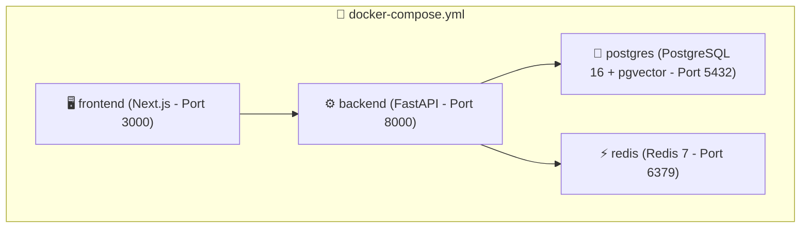

# ⚖️ AADALAT AI — Deployment & Docker Operations

## 1. Local & Production Deployment Options

Aadalat AI is containerized via Docker and Docker Compose.



---

## 2. Quickstart Execution

### Step 1: Environment Configuration
Copy the example environment file:
```bash
cp .env.example .env
```

### Step 2: Running with Docker Compose
```bash
docker-compose up --build -d
```

Services will be accessible at:
- **Frontend Web App:** `http://localhost:3000`
- **FastAPI API & OpenAPI Docs:** `http://localhost:8000/docs`
- **Health Check:** `http://localhost:8000/health`

---

## 3. Running Locally Without Docker

### Backend
```bash
cd backend
python -m venv .venv
# activate venv
pip install -r requirements.txt
uvicorn app.main:app --host 0.0.0.0 --port 8000 --reload
```

### Frontend
```bash
cd frontend
npm install
npm run dev
```

---

## 4. Health & Readiness Probes
- `GET /health`: Returns `{ "success": true, "data": { "status": "healthy", "service": "Aadalat AI" } }`
- `GET /api/v1/cases`: Validates database connectivity and ORM initialization.
