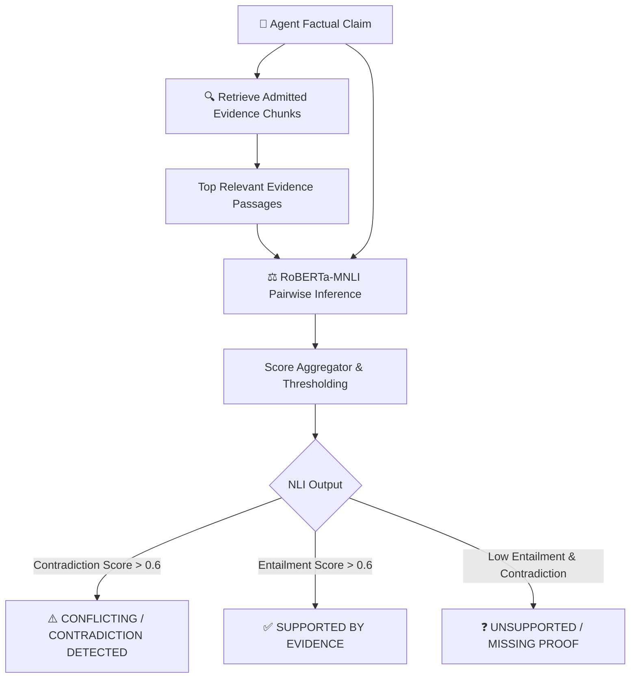

# ⚖️ AADALAT AI — Machine Learning Pipeline & Registry

## 1. Philosophy
Aadalat AI strictly avoids using generative LLMs for specialized deterministic classification, entity extraction, and contradiction checks. Instead, we implement a dedicated **Hugging Face ML Model Registry** hosting optimized models for task-specific intelligence.

---

## 2. Model Registry & Capabilities

| ML Task | Architecture / Model | Input | Output / Labels |
|---|---|---|---|
| **Legal NER** | `dslim/bert-base-NER` / Legal-NER-BERT | Raw legal text / exhibits | `PERSON`, `ORGANIZATION`, `COURT`, `JUDGE`, `LAWYER`, `STATUTE`, `SECTION`, `MONEY`, `DATE`, `CONTRACT` |
| **Case Classifier** | Zero-Shot BART / DeBERTa-v3 | Case narrative / petition | `CIVIL`, `CRIMINAL`, `CONSUMER`, `EMPLOYMENT`, `PROPERTY`, `CONTRACT`, `FAMILY`, `FINANCIAL`, `TECHNOLOGY`, `OTHER` |
| **Document Classifier** | Zero-Shot BART-MNLI | Document header / body | `JUDGMENT`, `ORDER`, `PETITION`, `AFFIDAVIT`, `NOTICE`, `CONTRACT`, `INVOICE`, `BANK_RECORD`, `MESSAGE`, `IMAGE` |
| **Legal Sentence Classifier** | Fine-tuned RoBERTa / Regex Rule Ensemble | Individual sentences | `FACT`, `CLAIM`, `COUNTERCLAIM`, `ARGUMENT`, `EVIDENCE_REFERENCE`, `LEGAL_PROPOSITION`, `COURT_FINDING`, `ORDER` |
| **NLI / Contradiction Engine** | `roberta-large-mnli` | `[Evidence Premise, Claim Hypothesis]` | `ENTAILMENT`, `CONTRADICTION`, `NEUTRAL` (with confidence probabilities) |
| **Embeddings** | `sentence-transformers/all-MiniLM-L6-v2` | Text chunks (384-dim) | Dense floating point vectors |

---

## 3. Contradiction & Claim Grounding Pipeline

---

## 4. Evaluation Metrics Tracked
- **NER:** Token-level and entity-level Precision, Recall, and Micro/Macro F1 score.
- **Classification:** Categorical Accuracy, Confusion Matrix, and Class-Weighted F1.
- **NLI & Grounding:** Contradiction Detection Accuracy, False Contradiction Rate, Grounding Precision.
