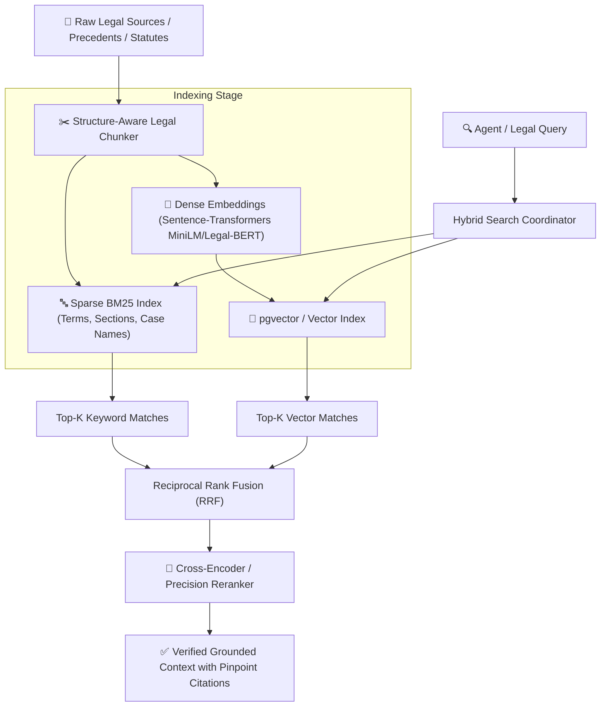

# ⚖️ AADALAT AI — Legal RAG & Retrieval Architecture

## 1. Overview
Legal documents possess strict structural hierarchies (headnotes, facts, legal issues, arguments, ratio decidendi, obiter dicta, findings, and formal orders). Standard fixed-length chunking destroys legal context. Aadalat AI implements **Structure-Aware Legal Chunking** combined with a **Hybrid Keyword + Vector Retrieval and Cross-Encoder Reranking** pipeline.

---

## 2. Ingestion & Retrieval Pipeline

---

## 3. Structure-Aware Legal Chunking
Rather than splitting every $N$ characters:
- **Headnote & Metadata Preserved:** Court name, bench, date, citation, CNR number, jurisdiction, statute sections.
- **Sectional Segmentation:**
  - `ISSUE_STATEMENT`: Specific questions of law framed by the court.
  - `FACTUAL_MATRIX`: Material facts established before the trial forum.
  - `RATIO_DECIDENDI`: Binding legal principles established by the judgment.
  - `OBITER_DICTA`: Persuasive judicial observations.
  - `OPERATIVE_ORDER`: Final direction and relief granted.

---

## 4. Citation Validation Subsystem
For every legal citation generated during courtroom argumentation:
1. **Lookup:** Query the legal knowledge base for matching citation key or case title.
2. **Passage Comparison:** Compare the agent's asserted legal principle against the authoritative paragraph.
3. **Status Assignment:**
   - `VERIFIED`: Exact statutory section or authoritative judgment confirming the proposition.
   - `PARTIALLY_SUPPORTED`: Authority exists but applies conditionally or with distinctions.
   - `UNVERIFIED`: Authority cannot be located or does not support the assertion.
